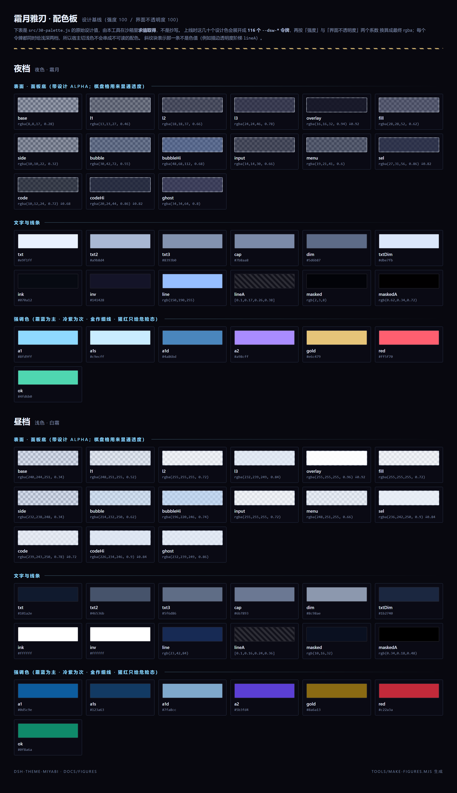
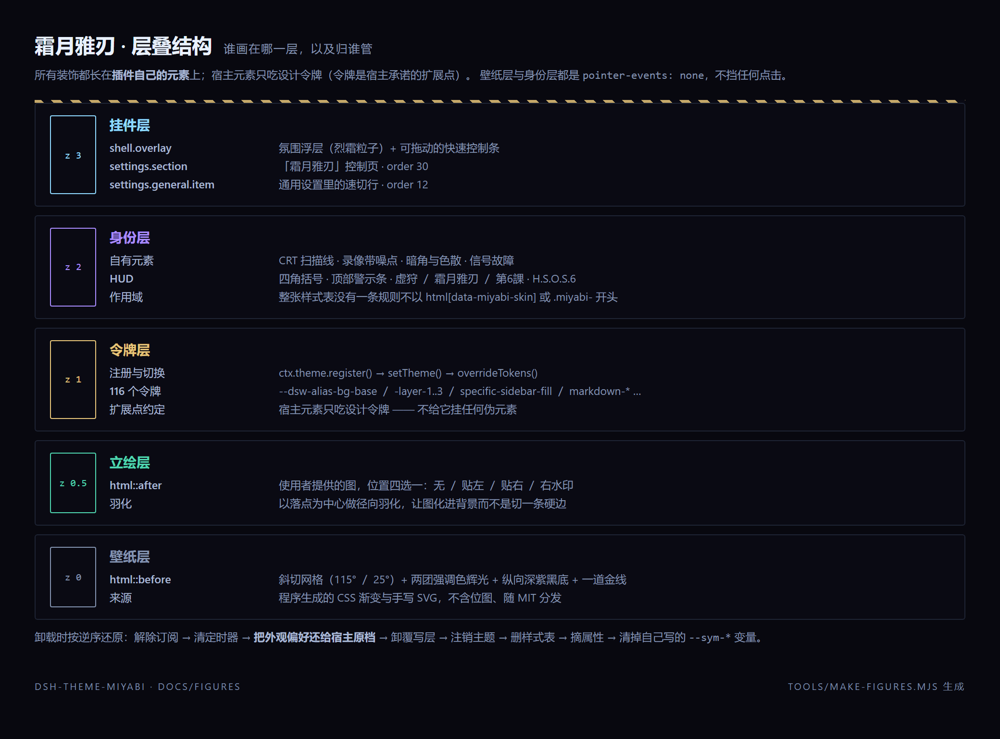
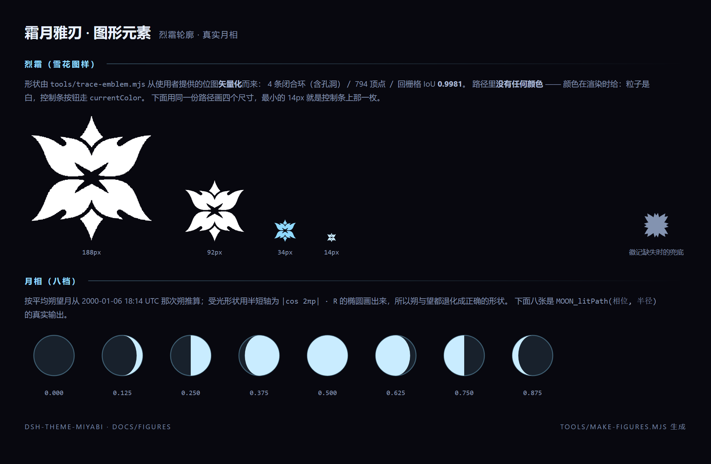
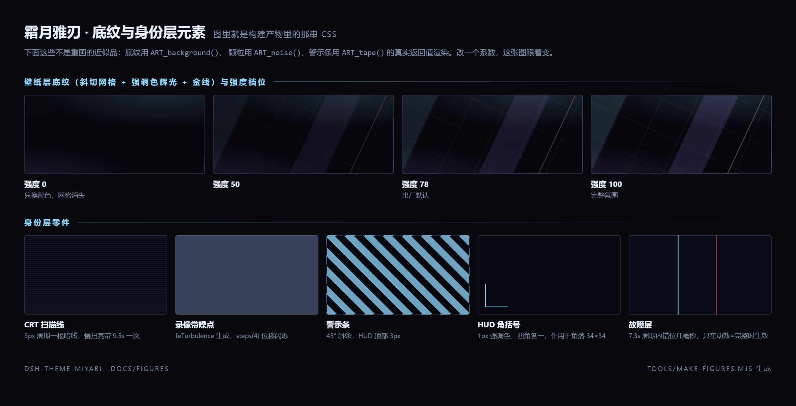

# dsh-theme-miyabi · 霜月雅刃

> 《绝区零》星见雅（Hoshimi Miyabi）主题的 **DeepSeek Harness Web UI** 皮肤插件。
> 霜蓝冷调令牌层 × 新艾利都街头复古未来的 CRT 身份层，配一套可调的氛围挂件。

[](https://github.com/InkDemon911/dsh-theme-miyabi/actions/workflows/check.yml)
[](LICENSE)
[](tools/check.mjs)

```
  霜 ── 霜蓝 × 冷紫 × 金线      唯一模式
```

| | |
|---|---|
| 包名 | `dsh-theme-miyabi` |
| 主题 id / loader 行 id | `dsh-theme-miyabi` |
| 版本 | 4.0.0 |
| 适配 | DeepSeek Harness 的 Web GUI 与桌面客户端（同一份代码，`dsh.client.platform` 只有 `web` 一个合法取值） |

> **仓库名、包名、主题 id 三者同名**（`dsh-theme-miyabi`），安装时 profile 的依赖键、
> loader 行 id 与 `ctx.theme` 里注册的主题 id 都是这一个名字，不会出现「按包名找不到行」的困惑。
> 4.0.0 之前叫 `@local/ui-skin-miyabi` / `ui-skin-miyabi`，改名的影响见
> [CHANGELOG](CHANGELOG.md#400)（**已有安装需要重装并重启**）。

---

## ⚠️ 素材版权（先看这一节）

本仓库**包含米哈游的版权素材**，它们**不在 MIT 许可范围内**：

| 文件 | 内容 | 权利 |
|---|---|---|
| `assets/miyabi-wallpaper.jpg` | 星见雅「1 月月历壁纸（PC 版）」，2560×1440 | 版权归 **miHoYo / HoYoverse** |
| `assets/ref/emblem-source.png` | 烈霜位图，2048×2048 | 同上 |

- `miyabi-wallpaper.jpg` 会以 base64 内嵌进构建产物 `client.js`，**所以 `client.js` 里也带着它**。

- **想要一个不含版权素材的版本**（推荐分发给别人时用这个）：

  ```bash
  rm -rf assets/miyabi-wallpaper.jpg assets/ref
  node tools/build.mjs
  ```

  清空后 `client.js` 从约 1.4 MB 掉到约 130 KB，立绘层自动隐藏（不报错、不留白框），
  烈霜仍然在 —— 它走的是 `assets/emblem.json` 里的**纯轮廓坐标**，与位图无关。
  细节见 [`assets/README.md`](assets/README.md)。

代码与自制素材（底纹、噪点、警示条、HUD、月相、刀光、粒子运动）随 [MIT](LICENSE) 分发。

---

## 图示

四张都是**示意图**，由 [`tools/make-figures.mjs`](tools/make-figures.mjs) 生成，不是界面截图。
它们不是手画的近似品：颜色与几何全部在沙箱里**从 `src/` 求值取得**，底纹那两张直接把
`ART_background()` / `ART_noise()` / `ART_tape()` 的返回值交给浏览器渲染 —— 改一个系数，图跟着变。



**配色板** —— `src/30-palette.js` 的全部设计色，夜档与昼档。表面色下面垫了浅色棋盘格，
用来显通透度（不然深色低 alpha 的表面在深底上就是一块黑）；`↓0.92` 这类标注是那张表面的
**alpha 下限** —— 「界面不透明度」调到 40% 时它不再跟着变透，菜单与代码块才压得住壁纸。
斜纹块表示那一条不是色值（例如描边透明度阶梯 `lineA`）。



**层叠结构** —— 谁画在哪一层、归谁管。宿主元素只吃设计令牌，装饰只长在插件自己的元素上。

| | |
|---|---|
|  | **图形元素**：烈霜轮廓（矢量化产物，同一份路径画 188／92／34／14px 四个尺寸）与八档月相（`MOON_litPath()` 的真实输出，朔与望都退化成正确形状）。 |
|  | **底纹与身份层元素**：斜切网格在强度 0／50／78／100 四档下的样子，以及扫描线、录像带噪点、警示条、HUD 角括号、故障层。 |

> 这些示意图**不含**米哈游的美术素材，也不含使用者的界面内容。版权说明见上一节。

---

## 特性

- **令牌层**：116 个 `--dsw-*` 设计令牌各给浅深两档取值。夜档是「霜月」，宿主机切浅色时
  自动变成昼档「白霜」，不会串成不可读的配色
- **身份层**：CRT 扫描线、录像带噪点（`feTurbulence`）、暗角与色散边、信号故障、
  HUD 四角括号与警示条、斜切网格底纹 —— 全部 `pointer-events: none`
- **挂件层**（三处纯新增槽位，不动宿主任何东西）：
  - `shell.overlay`：氛围浮层 + **可拖动的快速控制条**（主题开关、强度、霜点档、真实月相）
  - `settings.section`：「霜月雅刃」控制页
  - `settings.general.item`：通用设置里的一行速切
- **强度 0–100 无级调节**：0 = 只换配色（面板不透明、无氛围），100 = 完整氛围 + 通透面板
- **界面不透明度 40–100%（默认 40%）** 与**立绘不透明度 4–100%（默认 100%）**两个独立旋钮 —— 出厂就是「壁纸优先」的样子
- **立绘位置四选一**：无 / 贴左（默认）/ 贴右 / 右侧水印
- **烈霜**（雪花图样）的形状由 [`tools/trace-emblem.mjs`](tools/trace-emblem.mjs)
  从位图**矢量化**而来（回栅格 IoU 0.9981），路径不含颜色，颜色在渲染时给
- **无声音**、**无网络请求**、**不收集任何数据**：音效模块已整体移除，
  所有图形是本地 data URI、无跨域
- 关闭主题即**完整还原**宿主外观（含把外观偏好还回去）

---

## 安装

需要 DeepSeek Harness（`dsh`）已可用。仓库是插件源码，**不需要构建** ——
`client.js` 已随仓库提交。

### 1. 拿到源码

```bash
git clone https://github.com/InkDemon911/dsh-theme-miyabi.git
```

### 2. 以 link 方式装进某个 profile

```bash
# <profile> 换成你要用的 profile 名，例如 web、tauri
dsh plugin --profile <profile> add "link:<clone 下来的绝对路径>"
```

Windows PowerShell 例子：

```powershell
dsh plugin --profile web add "link:D:\plugins\dsh-theme-miyabi"
```

### 3. 确认 bundle 已启用

包声明了 `dsh.bundle.patch`，装好后应当出现在 profile 的 bundle 列表里：

```bash
dsh --profile <profile> --dump-config
```

应当能看到：

```yaml
- id: dsh-theme-miyabi
  name: 'dsh-theme-miyabi'
  disabled: false
```

如果没有，用插件管理器把这一行启用。

### 4. 重启 Harness

> ⚠️ **改 bundle 的启用状态需要重启进程**（startup profile 的语义），刷新页面不够。
> 之后**只改 `client.js` 内容**才由宿主 HMR 热更新。桌面客户端请整个退出再开。

### 5. 确认装上了

打开 **设置 → 霜月雅刃**，能看到控制页即成功。
控制条默认在**右下角**，是一枚月相小按钮。

### 卸载

```bash
dsh plugin --profile <profile> remove dsh-theme-miyabi
```

或者只关主题不卸包：**设置 → 霜月雅刃 → 关闭并还原宿主外观**（幂等，随时开回来）。

---

## 使用

| 位置 | 是什么 |
|---|---|
| **设置 → 霜月雅刃** | 控制页：开关、强度、界面不透明度、立绘位置与浓淡、动效与氛围六项、控制条形态、彩蛋、恢复默认 |
| **设置 → 通用 → 霜月雅刃** | 一行速切开关 |
| **右下角快速控制条** | 默认「图标」态：月相小按钮，点开变成长条 |

长条上是：`霜 / ·`（开关主题）· `− 78% ＋` 调强度 · 烈霜按钮循环霜点档 ·
月相按钮（点一下放刀光）· `☰` 快速设置弹层 · `—` 收回图标态。
**按住长条空白处可拖动**，位置记进配置，窗口缩小后自动夹回可视区。

### 可访问性

- `ESC` 收起快速设置弹层
- 所有控件都是真 `<button>` / `<input type="range">`：开关 `role="switch" aria-checked`，
  分段控件 `aria-pressed`，滑杆吃原生键盘行为，焦点环走 `--dsw-focus-ring-color`
- 系统开启「减少动态效果」时动效一律按关闭处理，**霜点与故障层直接不渲染**（不是靠 CSS 藏）
- 正文对比度实测：正文/强调文字最差 **5.39:1**，次级文字最差 **3.48:1**，
  填色按钮文字 6.69–18.51:1，代码高亮最差 4.84:1
- **没有替换系统光标**：只改焦点环与选区色（自定义光标需要位图，且在文本/拖拽场景伤可用性）

### 彩蛋（可关）

- 发送消息时一道斜向刀光（260ms，只动 `transform`/`opacity`；动效关闭时不出现）
- 在输入框里只输入 `miyabi` / `shimotsuki` / `霜月` / `虚狩` / `星见雅` 再回车
  → 刀光 + 一行「虚狩 · 出雲」浮字
- 面板上的月相是**真实月相**（按平均朔望月从 2000-01-06 18:14 UTC 那次朔推算），
  受光形状用半短轴为 `R·|cos 2πp|` 的椭圆画出来，朔/望/上下弦都退化成正确形状

---

## 配置项

全部配置存在浏览器 `localStorage`，键 `dsh-theme-miyabi:cfg:v2`（一份 JSON）。
**不收集、不上传任何数据**，也不使用 IndexedDB。

> 为什么不用宿主设置文档：第三方令牌层没有写入宿主 settings 的通道
> （`ctx.theme.setTheme()` 只持久化内建偏好 `light/dark/system`），
> 所以皮肤自己持有状态 —— 这也是生态里其它主题插件的通行做法。

| 键 | 取值 | 默认 | 说明 |
|---|---|---|---|
| `cfgRev` | 整数 | `4` | 设计基线版本。基线字段升版时自动拉回新默认，用户偏好不动 |
| `enabled` | bool | `true` | 总开关。关闭 = 摘掉 `data-miyabi-skin`、撤样式表、卸令牌层、把外观偏好还给宿主 |
| `intensity` | 0–100 | `78` | **0 = 只换配色**（面板不透明、无氛围）；**100 = 完整氛围 + 通透面板**。一个变量驱动全部效果层与面板 alpha |
| `panelOpacity` | 40–100 | `40` | **界面不透明度**（默认 40%）。只调**氛围面板**：100% = 设计值，越小画布／侧栏／卡片／气泡／输入框越透、壁纸越清楚。弹层、代码块、选区带 alpha 下限，不会被调到压不住壁纸 |
| `art` | `none` `left` `right` `watermark` | `left` | 立绘位置。贴左／贴右按高度贴合并坐在底边，水印是右侧竖直居中；横向超出由窗口裁掉。`none` 只关立绘、不关主题 |
| `artOpacity` | 4–100 | `100` | 立绘浓度（默认 100%）。夜档原样生效，昼档内部乘 0.5 天花板，防止照片压穿浅底文字 |
| `motion` | `full` `lite` `off` | `full` | 完整（含滚动亮带与故障闪烁）/ 轻微（霜点静止）/ 关闭。系统 `prefers-reduced-motion` 命中时强制为 `off` |
| `particles` | `off` `low` `mid` `high` | `mid` | 霜点 0 / 14 / 34 / 64 片，再按视口面积缩放（窄屏自动减量） |
| `scanlines` | bool | `true` | CRT 扫描线（3px 周期一根暗线） |
| `grain` | bool | `true` | 录像带噪点（`feTurbulence` 生成的 SVG，`steps(4)` 位移闪烁） |
| `vignette` | bool | `true` | 暗角 + 左右色散边 |
| `glitch` | bool | `true` | 信号故障（7.3s 周期里错位闪一下，只在 `motion=full` 时生效） |
| `hud` | bool | `true` | HUD 四角括号、顶部警示条、`虚狩` / `第6課` / `H.S.O.S.6` 标签 |
| `console` | `off` `tab` `bar` | `tab` | 快速控制条形态 |
| `consolePos` | `{x,y}` 或 `null` | `null` | 拖动后的位置；`null` = 右下角 18px |
| `followHostAppearance` | bool | `false` | 关（默认）时主题夺取外观偏好、锁夜档；开时让位给宿主：宿主浅色 → 昼档「白霜」，深色 → 夜档 |
| `easterEgg` | bool | `true` | 发送刀光、暗号浮字、可点的月相 |

坏值会被归一化（枚举回默认、数值夹到区间、非法坐标丢弃），不会流进样式层。

**关于「外观偏好被夺取」**：主题切到自己的 id 后，`设置 → 外观` 里的浅/深/跟随系统
选择框会显示为未选中。想让宿主自己管浅深色，打开 **跟随宿主浅深色偏好**；
想完全交还控制权，直接关主题。

---

## 效果描述

逐区域的实现说明。图见上面的[图示](#图示)，下面这一表是**做法**层面的对应关系，
每一条都对应代码与自检断言（自检量的不是「代码看起来对不对」，而是**改配置会不会把界面改坏**）。

| 区域 | 做法 |
|---|---|
| **壁纸层** | `html::before` 铺整套 `background` 简写：两团强调色径向光 + 纵向深紫黑底 + **斜切网格**（115°／25° 两向细网 + 三块硬边斜切色 + 一道金线）。底层面板刻意做得透（默认设置下画布层透出率 69%），壁纸从面板下透出来；强度 0 时网格消失、面板全不透明，退化成纯换色 |
| **立绘层** | `html::after`，位置四选一；以落点为中心做径向羽化，让图化进背景而不是切一条硬边；浓度由「立绘不透明度」控制 |
| **侧栏** | `--dsw-specific-sidebar-fill`（透出率 53%）+ 导航项 hover/active/active-accent 四个令牌 |
| **聊天区** | `--dsw-alias-bg-base / layer-1..3` 四档递进：越往上越实，正文落在可读性最稳的那一层 |
| **消息气泡** | `--dsw-specific-bubble`（霜蓝暗块）/ `-highlight`（更亮一档） |
| **输入框** | `--dsw-specific-input-major`；焦点环换成强调色 |
| **按钮** | 14 个按钮令牌。夜档主按钮是**霜白色块 + 深墨字**（硬色块 + 高对比），昼档换成深强调色 + 白字 |
| **滚动条** | 4 个 `--dsw-alias-scrollbar-*` 令牌换成冷调强调色（几何留给宿主，它有宽度、轨道内缩等一整套契约） |
| **代码块** | 12 个 markdown 令牌 + 9 个 `--shiki-token-*` 换成霜色语法表；`pre` 加 2px 强调色左条与 4px 硬投影。代码块保持 72% 不透明，压得住壁纸 |
| **Markdown** | 链接 / 行内码 / 标签 / 引用 / 占位色令牌；`blockquote` 左线转金 |
| **设置页** | `settings-card-fill/stroke` + 自有控制页：卡片带斜切角与硬投影 |
| **弹窗与菜单** | `bg-overlay`（94%，几乎不透）/ `bg-mask-1..3` / `bg-mask-photo` / `bg-mask-drop` / `specific-menu` / `--dsw-menu-surface-fill` / `menu-group-header-fill` / `tooltip-*`；菜单保持宿主自带的半透明 + backdrop blur |
| **通知 / 加载** | `toast-bg` / `toast-label`；`bg-skeleton` 取强调色 6% 叠层 |
| **选区 / 光标** | `::selection` 用强调色 32%；焦点环 = 强调色。系统指针不动 |
| **CRT 氛围** | 扫描线（3px 周期）+ 慢扫亮带（9.5s 一次）+ 噪点 + 暗角与色散边 + 故障闪（7.3s 周期内错位几毫秒）。全部 `pointer-events: none`，透明度由强度统一缩放 |
| **HUD** | 四角括号（1px 强调色）、顶部 3px 警示条（45° 斜条）、左上 `虚狩`、右上竖排 `霜月雅刃`、左下金色 `第6課 · H.S.O.S.6`。窄屏自动隐藏竖排与左下标签 |
| **霜点** | 烈霜徽记（形状矢量化自位图），每片独立尺寸/时长/延迟/横向漂移，只动 `transform` 与 `opacity` |
| **刀光** | 发送时一道 260ms 斜向刀锋（`scaleY` + `translate3d`）加一条 1px 裂纹线。只有画面，没有声音 |

---

## 实现：三层结构

```
令牌层  ctx.theme.register({ id, colorScheme:'dark', tokens })   注册主题（116 个令牌 × light/dark 两档）
        ctx.theme.setTheme(id)                                   切到它
        ctx.theme.overrideTokens(id, { light, dark })             每次改配置重建这一层
身份层  <style> + documentElement 上的 --sym-* 变量，全部作用域限定在 html[data-miyabi-skin]
挂件层  shell.overlay（氛围 + 控制条）· settings.section（控制页）· settings.general.item（速切行）
```

### 四条刻意的设计决定

**1. 令牌层两层都要，不是重复。**
`register()` 决定 `colorScheme`，顺带让宿主把 `data-ds-dark-theme` 设上（原生控件、滚动条、
下拉框跟着走）；`overrideTokens` 负责「改配置即时生效」与「浅色档也有值」——
它按当前配色折叠 `{light, dark}`，所以宿主切浅色时自动变成昼档「白霜」。

**2. 必须处理 `setTheme` 被顶回去。**
`setTheme()` 只把 `light/dark/system` 写进宿主设置文档，第三方 id 不持久化；
而 settings scope 一推送，`ThemeRuntime.adopt()` 就会把偏好改回宿主里存着的那个。
所以插件订阅 `theme/change`，发现偏好被改回去就再抢回来（最小间隔 1.5s）；
用户打开「跟随宿主浅深色偏好」时则主动让位。

**3. 面板 alpha 是壁纸的总闸门，所以单独立了断言。**
底层表面画在壁纸之上，透明度就是壁纸可见度。2.0.0 曾把画布层定成 0.62，
默认强度下壁纸只剩 29.6% 透出、立绘实际可见度只有 7.7%（看起来就是「壁纸没生效」）。
现在画布层 0.28、侧栏 0.32，并把「画布/侧栏透出率 ≥ 50%、弹层 ≤ 10%、代码块 ≤ 35%」
写成断言钉死，防止再次被「顺手调实」。

**4. 不嫁接宿主元素的伪元素。**
宿主元素只吃设计令牌（令牌是宿主承诺的扩展点），所有装饰长在插件自己的元素上
（`html[data-miyabi-skin]::before/::after` 两个画布层 + 自有浮层）。整张样式表里
**没有一条规则不以 `html[data-miyabi-skin]` 或 `.miyabi-` 开头**，这条由脚本强制检查。

### 卸载与还原

`ctx.effect` 的清理函数按逆序：解除全部订阅 → 清定时器 → **把外观偏好还给宿主原档** →
卸覆写层 → 注销主题 → 删样式表 → 摘属性 → 清掉自己写的 `--sym-*` 变量。
不留残留，也不影响别的主题插件。

---

## 兼容性与自检

```bash
node tools/build.mjs          # 构建 client.js（零依赖、无子进程、不写临时文件）
node tools/trace-emblem.mjs   # 换了徽记位图时重跑：位图 → 轮廓（自证 IoU）
node tools/check.mjs          # 143 项自检，退出码即结论
```

`check.mjs` 检查的是**「改配置会不会把界面改坏」**，而不是「代码看起来对不对」：

| 组 | 内容 |
|---|---|
| 清单 | `package.json` / `exports` / `dsh.bundle.patch` / `dsh.client`(platform·immediately·inject) / patch 行 id 与包名对齐 / icon ≤256 KiB / locale 双语齐全 |
| 产物 | `__ModuleLoader__.load` 形态、模块 id = 包名、**require 白名单只有 `react`**、导出 isPlugin/inject/apply、素材注入位已替换、产物含内嵌 JPEG |
| 求值 | 把 `src/*.js` 拼起来在沙箱里求值一次，确认 exports 形态与 inject 名单 |
| 令牌 | **116 个令牌名逐个核对**在本机 `dsh-client-ui-theme` 真实令牌名单里；每个都给 light/dark 两值 |
| 对比度 | 半透明面板合成到背景两端色上逐对算 WCAG（结果见上文「可访问性」） |
| 壁纸 | 画布/侧栏透出率 ≥ 50%、弹层 ≤ 10%、代码块 ≤ 35%、立绘可见度夜档 ≥ 18% 昼档 ≥ 10%、**立绘不透明度按档位生效（夜档原样／昼档 0.5 天花板）**、强度 0 时面板完全不透明、界面不透明度调低必须真的更透、**最狠组合（强度 100% ＋ 界面不透明度 40%）下弹层与代码块仍压得住壁纸** |
| 作用域 | 身份层每条选择器必须落在 `html[data-miyabi-skin]` / `.miyabi-` 内；`!important` 计数；`prefers-reduced-motion` 与动效总开关存在 |
| 收敛 | 已删除的模块不得复活：扫描产物，`AudioContext`/`SND_`/`ART_crest`/`indexedDB`/`customUrl`/`'artSource'`/`'blade'`/`'night'`/… 一个都不许出现；枚举只剩 art/console/motion/particles；配置里没有 pattern/mode/sound/volume |
| 徽记 | `emblem.json` 存在、viewBox 64×64、路径 M…Z、**子路径数与轮廓数一致（4 环含孔洞）**、**路径里没有任何颜色**、`fill-rule` 是 evenodd、**IoU ≥ 0.97**、全部坐标落在 0..64、产物里确实内嵌了该轮廓 |
| 用语 / 配置 / 图形 | zh/en 键集合完全一致、枚举取值都有文案键、无残留已删模块文案；坏值被归一化夹回、上一版遗留键被无视；纹样浓度随强度变化、data URI 转义正确、月相 8 档路径合法 |

### CI

[`.github/workflows/check.yml`](.github/workflows/check.yml) 在每次推送/PR 时：
构建一次 → **校验提交的 `client.js` 与 `src/` 一致**（否则报错，防止产物与源码脱节）→
跑 143 项自检 → 重新矢量化徽记并与提交的 `emblem.json` 对比。

### 已验证到哪一步（如实说明）

**一、宿主侧接线**（本机 Harness 实际运行核对通过）：

- 宿主正常提供 bundle：`/plugins/??dsh-theme-miyabi/client.js`（HTTP 200，约 1.4 MB）
- boot graph 里本包一行带正确依赖边：
  `inject: ["@deepseek-ai/dsh-client-ui-theme","@deepseek-ai/dsh-client-ui-slots"]`、`immediately: true`
- **三个槽位都在运行时确认已注册且 `active: true`**（`cordis_inspect_query` → `Slots.listSubTree`）：
  `shell.overlay` → `miyabi-atmosphere`、`settings.section` → `miyabi`(order 30)、
  `settings.general.item` → `miyabi-skin`(order 12)
- 多次重建 bundle（revision 变化 → HMR 推给页面）后，`miyabi-atmosphere` 仍然注册且 active

**二、页面内计算值**（开发时用无头 Edge + DevTools 协议在真实页面里读回，默认设置下实测）：

| 探针 | 实测值 | 说明 |
|---|---|---|
| `documentElement[data-miyabi-skin]` | `frost` | 身份层标记已挂上 |
| `data-miyabi-scheme` / `data-miyabi-motion` | `dark` / `full` | 夜档、完整动效 |
| `style[data-miyabi-skin]` 数量 | `1` | 身份层样式表已注入，且只有一张 |
| `--dsw-alias-bg-base` | `rgba(8, 8, 17, 0.307)` | 与代码算出的 0.3074 吻合（界面不透明度 40%） |
| `--dsw-alias-bg-overlay` | `rgba(16, 16, 32, 0.938)` | 弹层下限生效（设计 0.94） |
| `--dsw-alias-markdown-code-block` | `rgba(10, 12, 24, 0.75)` | 代码块下限生效（设计 0.72） |
| `.miyabi-hud-label` / `.miyabi-particle` | `3` / `34` | 三个 HUD 标签、34 片霜点（默认档） |

**三、观感**：开发时确实在真实浏览器里跑过，并把渲染结果**逐张看过**（按 3× 放大核对过
HUD 角标、烈霜形状与扫描线）。这一轮看图的收获是修掉了两个自检抓不到的问题：通用设置里
那行还写着「立绘固定左侧」（早已是四选一），左下角金色标签横排时会压在宿主自己的「设置」
按钮上（现改为沿左缘竖排，实测与按钮 `overlaps: false`，留 8px 间隙）。

> 这些渲染核对的截图**没有作为交付物放进仓库** —— 它们会带上使用者的桌面与工作区信息，
> 而且画面里有米哈游的版权美术。正文用的是上面的[图示](#图示)。

**仍然没有验证的**：

- **跨环境观感**。核对只在本机做过（Windows + Edge、1440×900、同一张壁纸）。换成别的壁纸亮度、
  别的缩放比例、别的浏览器，观感都可能不同，需要你自己看一眼。
- **浅色档没有实拍**。昼档要宿主切到浅色才出现，本轮只核对过夜档。
- **浏览器控制台没有读**。没有接 `Runtime.consoleAPICalled`，所以「有没有报错」只由
  「界面渲染正常」间接推断。
- **交互路径只走了一部分**。自动化只覆盖了主界面、控制条、设置页两张。拖拽控制条、
  暗号彩蛋（`霜月` 等）、月相点击放刀光这三条没有自动化覆盖。

### 已知限制

1. **与其它主题插件互斥**：多个插件都往 `body` 行内写 `!important` 令牌时是「后加载者赢」。同时只开一个。
2. **夺取外观偏好是刻意的**：见「配置项」末尾。
3. **`followHostAppearance` 下昼档是另一套设计**（冷白纸 + 深强调色），不是把夜档调亮；昼档立绘浓度会被内部乘 0.5。
4. **产物约 1.4 MB，主要是内嵌立绘**（base64 比原字节大约 1/3）。清空 `assets/` 里的位图重新构建可回到约 130 KB。
5. **改 bundle 的启用状态要重启进程**；只改 `client.js` 内容由宿主 HMR 推送。

### 常见问题

**`dsh --profile X --dump-config` 报 `patch: entry "xxx" not found`？**
profile 的 `cordis.patch.yml` 里有一条 `- id: <某行>, disabled: true`，但那个 bundle 处于停用状态、
它插的行并不存在 —— 这会让**整层 patch 组合失败**（进而可能连累同一层里其它行）。
把那个 bundle 启用（它的行随后仍会被 patch 关掉，视觉无变化），或删掉那条 patch 项。

---

## 文件结构

```
dsh-theme-miyabi/
├─ package.json          # dsh.bundle.patch + dsh.client(web, immediately, inject)
├─ cordis.patch.yml      # 插入 loader 行：id dsh-theme-miyabi
├─ index.js              # 宿主半侧：空 apply，只为让这一行可挂载
├─ client.js             # ★ 构建产物（安装用的就是它，约 1.4 MB，含内嵌立绘）
├─ icon.svg              # 插件图标
├─ LICENSE               # MIT（仅覆盖代码与自制素材）
├─ CHANGELOG.md
├─ locale/{zh,en}.json   # 插件卡片文案
├─ docs/figures/         # README 图示（示意图，由 tools/make-figures.mjs 生成，不含版权素材）
├─ assets/
│   ├─ README.md              # 素材版权分区说明（重要）
│   ├─ art.json               # 逐素材来源/尺寸/sha256/授权，构建时注入，设置页直接显示
│   ├─ miyabi-wallpaper.jpg   # 立绘原图（2560×1440，逐字节，未修改）※版权素材
│   ├─ emblem.json            # 烈霜轮廓（矢量化产物，不含颜色）
│   └─ ref/emblem-source.png  # 徽记源位图（仅供复现矢量化）※版权素材
├─ src/                  # 源码：10 个片段，按文件名顺序共享同一个工厂作用域
│   ├─ 10-meta.js        #   元信息、枚举、配置基线版本、zh/en 用语表、颜色工具
│   ├─ 20-store.js       #   配置存储与归一化、基线迁移、月相、环境感知
│   ├─ 30-palette.js     #   调色板与 116 个令牌（昼/夜 × 强度 × 界面不透明度）
│   ├─ 40-art.js         #   斜切网格底纹、立绘层、烈霜/噪点/警示条
│   ├─ 45-assets.js      #   打包素材注入点 + 运行时状态
│   ├─ 50-styles.js      #   身份层样式表（壁纸层/CRT/HUD/组件/动效开关/窄屏）
│   ├─ 70-effects.js     #   霜点粒子、刀光总线、暗号监听（无声音）
│   ├─ 80-settings.js    #   设置页与控制件（开关/分段/滑杆/卡片）
│   ├─ 85-console.js     #   氛围浮层、HUD、月相、可拖动控制条
│   └─ 90-apply.js       #   apply()：令牌层编排、自愈、槽位注册、卸载还原
├─ tools/
│   ├─ build.mjs             # 零依赖构建：src + assets → client.js（含语法检查与体积报告）
│   ├─ trace-emblem.mjs      # 位图 → 轮廓矢量化（解 PNG/走边界/简化/回栅格 IoU 自证）
│   ├─ check.mjs             # 零依赖自检：143 项
│   ├─ make-figures.mjs      # README 图示：从 src 求值取色 + 无头 Edge 渲染（本机开发用，不进 CI）
│   ├─ publish-preflight.mjs # 发布前检查（README 完整性、交付文件、待提交清单）
│   └─ publish-github.mjs    # 一键发布到 GitHub（默认 dry-run，--apply 才动手）
└─ .github/workflows/check.yml
```

### 开发循环

```bash
node tools/build.mjs              # 改完 src/ 或 assets/ 后跑这一条
node tools/check.mjs              # 提交前跑
node tools/make-figures.mjs       # 改动了配色/底纹/图形时重出图示（只需本机有 Edge）
node tools/publish-preflight.mjs  # 发布前：README 完整性 / 交付文件 / 待提交清单
```

`make-figures.mjs` 的两个要点：颜色与几何从 `src/` **求值**取得（与 tools/check.mjs 同一套沙箱），
所以图不可能与代码脱节；底纹类图直接用生产函数的返回值渲染，不是重画的近似品。

### 发布到 GitHub（仅仓库维护者）

```bash
gh auth login                     # 只需一次
node tools/publish-github.mjs     # 默认 dry-run，打印将要做什么
node tools/publish-github.mjs --apply
```

`publish-github.mjs` 会：取你的 GitHub 登录名 → 替换仓库里的 `InkDemon911` 占位符与
LICENSE 版权行 → 设好 git 署名 → **重新构建并跑自检（不过就中止）** →
把改动收进首次提交 → `gh repo create dsh-theme-miyabi --public --source=. --push`。
幂等，可重复执行。

`src/*.js` **不是独立模块**，而是拼接进同一个工厂作用域的片段：不允许出现
`import` / `export`（构建脚本会直接报错），顶层声明要唯一命名（前缀约定：
`META_` / `CFG_` / `PAL_` / `ART_` / `CSS_` / `FX_` / `UI_` / `SET_` / `RUN_`），
导出统一写在 `90-apply.js`。

---

## 许可

- **代码与自制素材**：MIT，见 [LICENSE](LICENSE)。
- **第三方版权素材**（立绘与徽记位图）：版权归 miHoYo / HoYoverse，非商业同人用途，
  见 [assets/README.md](assets/README.md)。
- 本项目为粉丝同人作品，与米哈游、HoYoverse、DeepSeek 均无关联，也未获官方授权。
  角色与美术版权归 miHoYo / HoYoverse 所有；如侵权请联系删除。
